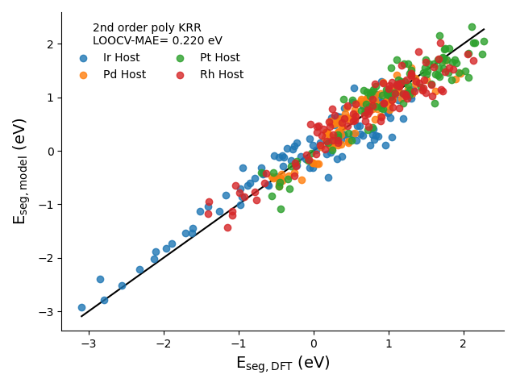

# BCSeg

BC Model-inspired segregation energy (Eseg) model for single atom alloy (SAA) nanomaterials.

- Trained on periodic slab SAA DFT data (plot below)
- Applicable to nanoparticle SAAs



*Reproduce parity plot by running `python eseg_model.py`*

## Easily predict Eseg with a few lines of code

```python
from eseg_model import get_eseg_model
model = get_eseg_model()
predicted_eseg = model.predict(X)
```

See **eseg_model.py** and **example.py** for additional details

## Features

BCSeg utilizes **5** simple, host- and dopant-based features that avoid costly calculations, like Density Functional Theory.

### ΔCE / CN

- ΔCE = CE<sup>host</sup> - CE<sup>dopant</sup>
- CE<sup>i</sup> = cohesive energy of monometallic material (eV)
  - For periodic slabs, CE = CE<sub>bulk<sub>
  - For nanoparticles, CE = CE<sub>NP</sub>
- CN = coordination number (number of bonds)

### χ<sup>host</sup>

- Gordy electronegativity of the host

### ΔEA

- EA = electron affinity (eV)
- ΔEA = EA<sup>host</sup> - EA<sup>dopant</sup>

### r<sup>dopant</sup>

- atomic radius of the dopant (Å)

### IP<sup>dopant</sup>

- ionization potential (IP) of the dopant (eV)
